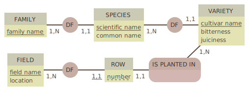
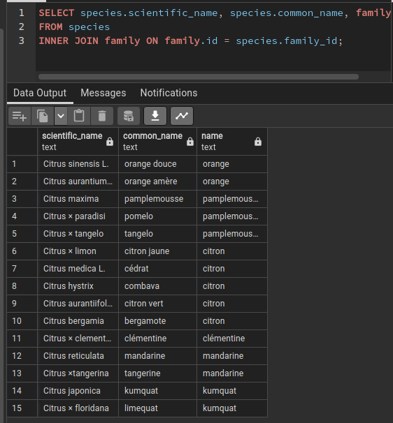
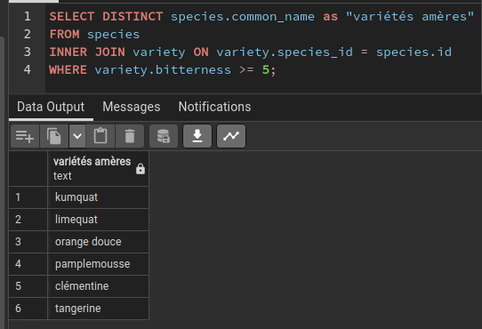
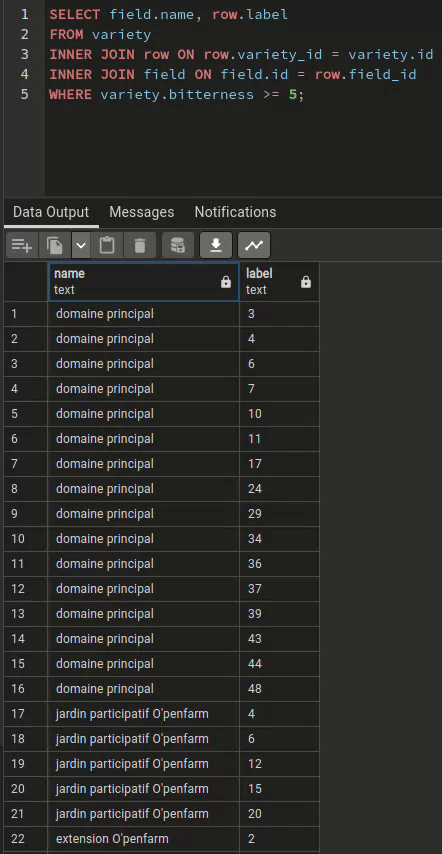
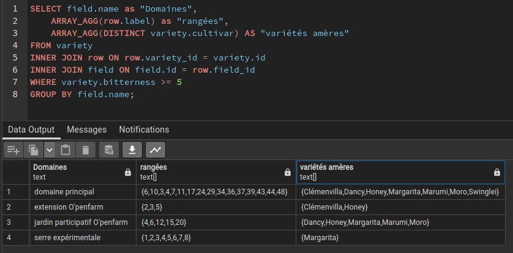
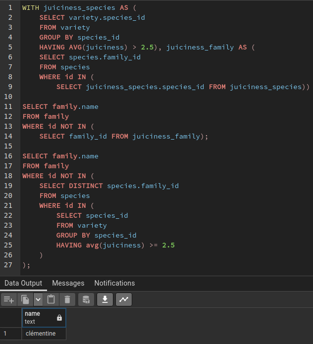
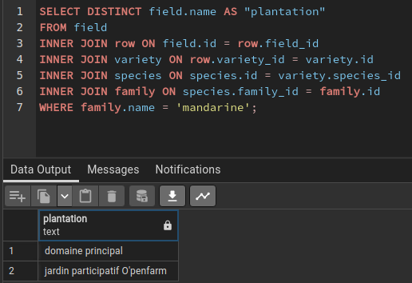

# Gestion d'une orangeraie

## Le modèle



---

# Afficher le nom scientifique, le nom commun et la famille de toutes les espèces

```SQL
SELECT species.scientific_name, species.common_name, family.name
FROM species
INNER JOIN family ON family.id = species.family_id;
```  

 


# Afficher les espèces pour lesquelles il existe au moins une variété ayant une armertume de 5

```SQL
SELECT DISTINCT species.common_name as "variétés amères"
FROM species
INNER JOIN variety ON variety.species_id = species.id
WHERE variety.bitterness >= 5;
```

 


# Afficher le nom de la plantation et le libellé des rangées concernées (une ligne par rangée)

```SQL
SELECT field.name, row.label
FROM variety
INNER JOIN row ON row.variety_id = variety.id
INNER JOIN field ON field.id = row.field_id
WHERE variety.bitterness >= 5;
```

 

# Ici le même résultat mais rangé par plantation sous form de tableau 

```SQL
SELECT field.name as "Domaines",
    ARRAY_AGG(row.label) as "rangées",
    ARRAY_AGG(DISTINCT variety.cultivar) AS "variétés amères"
FROM variety
INNER JOIN row ON row.variety_id = variety.id
INNER JOIN field ON field.id = row.field_id
WHERE variety.bitterness >= 5
GROUP BY field.name;
```
 


# Les familles ayant une jutosité moyenne supérieure à la moyenne (2.5, vu qu'on les note de 0 à 5)

```SQL
WITH juiciness_species AS (
	SELECT variety.species_id
	FROM variety
	GROUP BY species_id
	HAVING AVG(juiciness) > 2.5), juiciness_family AS (
	SELECT species.family_id
	FROM species
	WHERE id IN (
		SELECT juiciness_species.species_id FROM juiciness_species))

SELECT family.name
FROM family
WHERE id NOT IN (
	SELECT family_id FROM juiciness_family);

SELECT family.name
FROM family
WHERE id NOT IN (
	SELECT DISTINCT species.family_id
	FROM species
	WHERE id IN (
		SELECT species_id
		FROM variety
		GROUP BY species_id
		HAVING avg(juiciness) >= 2.5
	)
);
```

 


# Liste des plantations qui produisent de la mandarine

```SQL
SELECT DISTINCT field.name AS "plantation"
FROM field
INNER JOIN row ON field.id = row.field_id
INNER JOIN variety ON row.variety_id = variety.id
INNER JOIN species ON species.id = variety.species_id
INNER JOIN family ON species.family_id = family.id
WHERE family.name = 'mandarine';
```

 